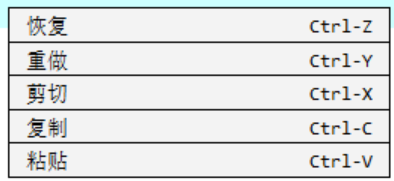

# 用户使用手册

## 使用界面介绍

轻量级C代码编辑器的操作主界面与Dev-C类似，程序打开即为代码编辑界面。界面上方为菜单栏，设置“文件”，”编辑“，”帮助“，‘“运行”四个板块，菜单栏正中间为文件名，程序打开默认为未保存的新文件，名称为”无标题“。界面左侧显示行号，菜单栏下方是代码编辑区域，当前行有高亮。


在打开的窗口中可以直接开始在代码编辑区域编写代码，与Dev-C的使用一样。


用户可以通过快捷键Ctrl-+、Ctrl- -对代码编辑区域的字体进行放大与缩小，也可以通过右键菜单执行文本的编辑功能。


## 文件操作介绍

 轻量级C代码编辑器实现了基础的文件操作，在菜单栏中点击“文件”菜单（再次点击“文件”菜单可关闭菜单），可以选择各项功能，同样也可以通过键盘快捷键操作。


### 新建文件

点击“新建”按钮或者键盘输入相应快捷键，程序将自动新建一个无标题文件，如果之前正在编辑的代码并未保存，程序将会弹出窗口提示。

### 打开文件

点击“打开”按钮或者键盘输入相应快捷键，程序将会自动跳出打开系统文件的窗口，您可以直接打开电脑中保存的C语言源程序进行编辑。

### 保存与另存为文件

（1）保存：在打开或者新建的C语言源程序文件中进行编辑后，点击“保存”按钮或键盘输入相应快捷键，可以保存当前的代码为C语言源程序，如果当前程序文件为新建文件，用户需要在弹出的交互窗口中选择路径进行保存，否则默认为保存至当前路径。

（2）另存为：点击“另存为”按钮或键盘输入相应快捷键，程序将会弹出交互窗口，用户可以将文件另存到指定路径。

### 关闭文件

点击“关闭”按钮或键盘输入相应快捷键，当前打开的文件将会关闭，如果是未保存文件，程序将会弹出提示窗口，用户可以选择是否保存。

### 退出应用

点击“退出”按钮、键盘输入相应快捷键或点击界面右上角的”X“，将会退出应用，未保存的文件同样会弹出提示窗口，用户可以选择是否保存。

## 代码编辑操作介绍

### 界面操作

#### 光标定位

使用鼠标点击所需代码文本位置可以将光标自动定位到字符之间，在行末点击光标将自动定位到该行末尾。

#### 界面移动

代码编辑区域显示界面随着光标的改变而移动，当光标超出当前显示区域后，当前显示区域将移动至能显示光标。

#### 文本增删

在轻量级C代码编辑器的代码编辑区域可以实现代码文本的输入和删除，代码文本内容同时支持英文与中文字符。

#### 文本选中

通过鼠标左键的选中与鼠标的拖动，用户可以实现对于代码文本的区域选中，被选中的区域自动修改底色。


### 代码文本内容编辑

轻量级C代码编辑器实现了包括恢复、重做、剪切、复制、粘贴的代码文本编辑功能，可以通过点击菜单栏“编辑”菜单（再次点击可以关闭）下的对应按钮以及右键菜单中的对应按钮，或者键盘输入相应快捷键进行操作。




#### 恢复

在完成了以此代码文本的编辑操作之后，可以通过鼠标点击“恢复”按钮或者相应快捷键来取消本次操作。恢复后光标定位在上次操作光标出现的最后位置。

#### 重做

重做：在进行恢复操作之后，用户可以通过点击“重做”按钮或键盘输入相应快捷键来重新完成被取消的操作。

#### 剪切

用户可以通过选中需要剪切的代码文本内容之后点击“剪切”按钮或者键盘输入相应快捷键进行代码文本的剪切操作。程序将会和windows剪贴板交互，将需要剪切的内容写入windows剪贴板，这意味着在其他程序中同样可以使用。

#### 复制

用户可以通过选中需要复制的代码文本内容之后点击“复制”按钮或者键盘输入相应快捷键进行代码文本的复制操作。程序将会和windows剪贴板交互，将需要复制的内容写入windows剪贴板，同样，在其他程序中也可以使用。

#### 粘贴

用户可以通过在光标处点击“粘贴”按钮或者键盘输入相应快捷键实现代码文本内容的粘贴操作。程序将与windows剪贴板交互读取剪贴板存储的内容，并将其写入当前光标所在处，并将覆盖之前所写的代码文本内容。

## 帮助菜单

### 关于

关于界面是对本程序的开发团队和用到的相关文件的介绍，同时我们参考Dev-C以及各编辑器的Donate选项，设置了Donate按钮，用户可以通过点击为乡村支教做些贡献。


点击左上角的“返回”按钮即可返回到主界面。

### 使用说明

点击“使用说明”按钮即可跳转到使用说明网页。

## 运行操作

### 编译

用户可以点击“运行”菜单中的“编译”按钮或相应快捷键进行C语言源程序的编译，生成的.exe文件将与源程序在同一目录下。如果当前C语言源程序并未保存，将弹出提示窗口。需要注意的是，该功能为本小组添加的附加功能，用户需要确保本机上成功安装了gcc并将其添加到环境变量中。

### 运行

用户可以通过点击“运行”菜单中的“运行”按钮或相应快捷键运行当前生成的.exe文件，程序将于windows控制台交互运行先前生成的.exe文件，需要注意的是，如果想要在控制台中看到输出结果，需要在程序中加上**system("pause");**语句。例如

```c
#include<stdio.h>
#include "windows.h"
int main(){
	printf("hello world");
    system("pause");
    return 0;
}
```

### 编译运行

用户可以通过点击“运行”菜单中的“编译运行”按钮或相应快捷键进行C语言源程序的编译运行。生成的.exe文件将于源程序在同一目录下，同样如果想要在控制台中看到输出结果，需要在程序中加上**system("pause");**语句。
